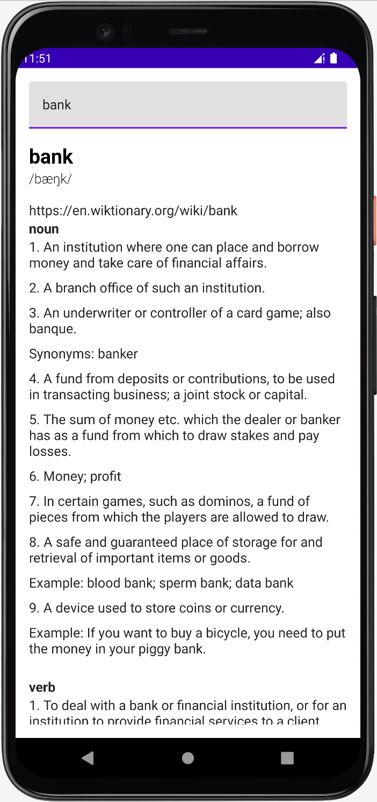

# DictionaryApp

A Jetpack [Compose][compose_ref] Dictionary Android App (With Caching) using a [clean architecture][clean_arc_ref]

## Key Features
- [Retrofit][retrofit_ref] is used for Networking
- [Hilt][hilt_ref] is used for Dependency Injection
- Offline caching is implemented using [Room][room_ref] as a single source of truth
- **Search functionality** powered by _Kotlin Flows_
- The [Free Dictionary API][dict_api_ref] is used as the backing source for words in the app

## App Screens
### Home Screen

### Search page (with or without Internet)

### Demo video

https://user-images.githubusercontent.com/3297681/199222949-5ecbca30-bc6b-41b5-a1f2-20b14dc23efe.mov

## Git Branches
The project uses a *main*, *develop* & *feature/*** branches inspired by [Git-flow-workflow][git_flow_ref].

### main
Contains the final implementation

### starter
Contains the starting implementation

### develop
The active development branch

### feature/**
The feature branches (not deleted) showing the evolution of the project implementation for each feature. All feature branches have already been merged into the development branch.

[clean_arc_ref]: https://developer.android.com/topic/architecture
[compose_ref]: https://developer.android.com/jetpack/compose
[retrofit_ref]: https://square.github.io/retrofit/
[hilt_ref]: https://developer.android.com/training/dependency-injection/hilt-android
[room_ref]: https://developer.android.com/jetpack/androidx/releases/room
[dict_api_ref]: https://dictionaryapi.dev
[git_flow_ref]: https://www.atlassian.com/de/git/tutorials/comparing-workflows/gitflow-workflow
